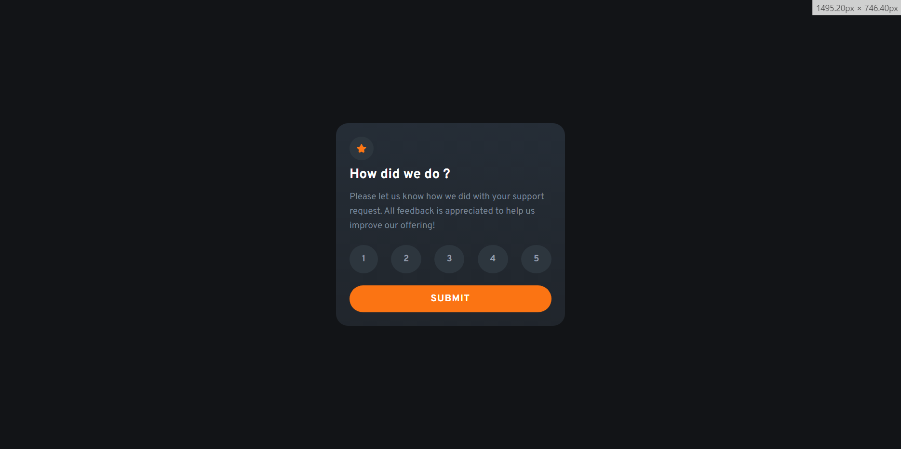
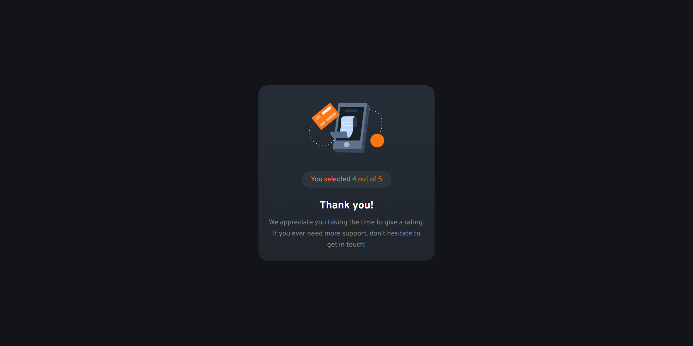
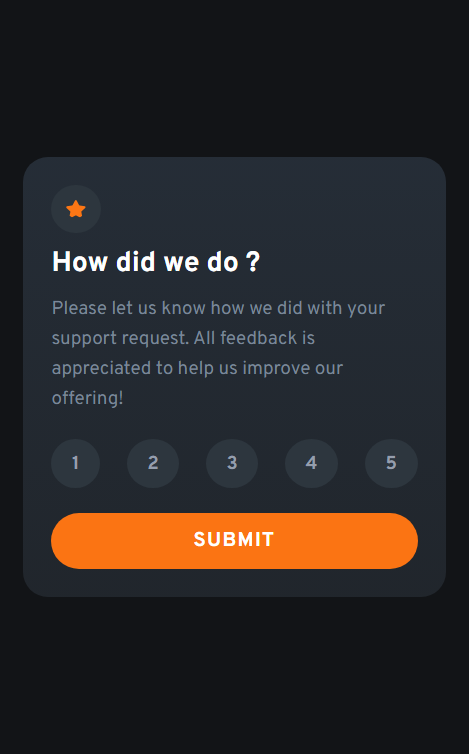
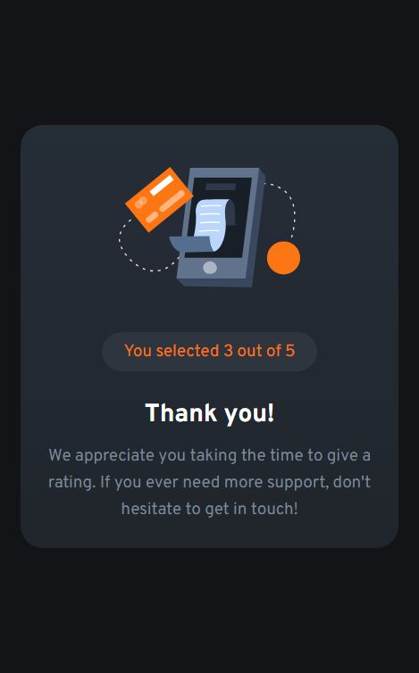

# Frontend Mentor - Interactive rating component solution

This is a solution to the [Interactive rating component challenge on Frontend Mentor](https://www.frontendmentor.io/challenges/interactive-rating-component-koxpeBUmI). 

## Table of contents

- [Overview](#overview)
  - [Screenshot](#screenshot)
  - [Links](#links)
- [My process](#my-process)
  - [Built with](#built-with)
- [Author](#author)

## Overview

### Desktop :

## Mobile :

### Links

- Live Site URL: [Live Server](https://plmohamed.github.io/Interactive-rating-component/)

## My process

### Built with

- Semantic HTML5 markup
- CSS custom properties
- Flexbox
- Javascript

## Author

  - Frontend Mentor - [@PLMohamed](https://www.frontendmentor.io/profile/PLMohamed)
  - Instagram - [@Mohamed_Boumedine](https://www.instagram.com/mohamed_boumedine/)

